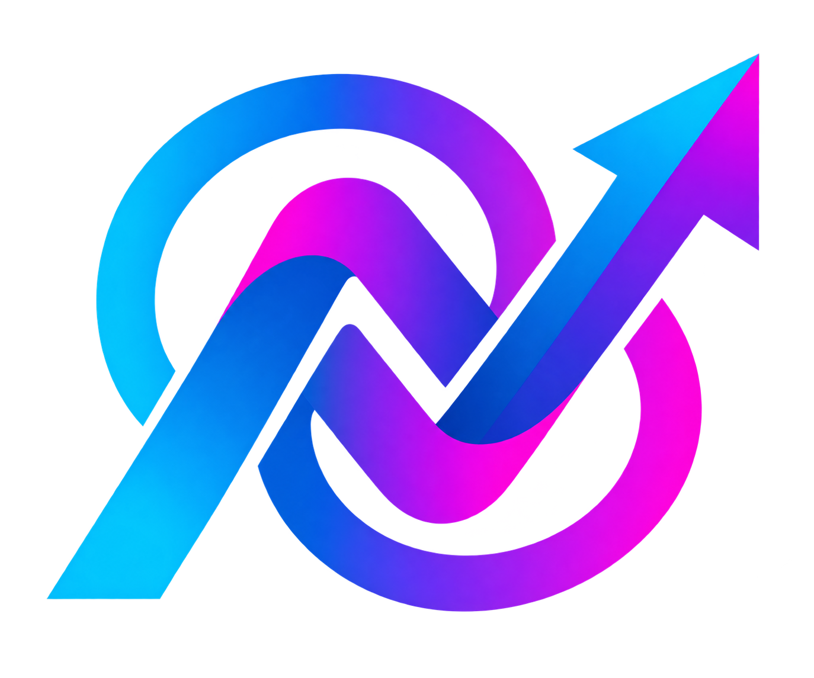

<p align="center">
  
</p>

<h1 align="center">Nexa — Web Profile Agency</h1>

<p align="center">
  Company profile website untuk agency IT yang bergerak di bidang <b>Web Development</b>, <b>Data Analysis</b>, dan <b>Game Development</b>.
</p>

<p align="center">
  
  
</p>

---

## 📖 Tentang Nexa

**Nexa** adalah agency IT yang membantu bisnis membangun kehadiran digital dan mengambil keputusan berbasis data. Kami fokus pada tiga layanan utama:

- 🌐 **Web Development** — pembuatan website company profile, landing page, web app, hingga sistem custom (Laravel, Vue.js, dsb).
- 📊 **Data Analysis** — pengolahan, visualisasi, dan interpretasi data untuk mendukung pengambilan keputusan bisnis.
- 🎮 **Game Development** — pengembangan game 2D/3D untuk kebutuhan hiburan maupun edukasi (Unity).

Repositori ini berisi source code untuk website company profile Nexa — media promosi digital yang menampilkan layanan, portofolio, tim, dan kontak agency.

---

## ✨ Fitur Website

- [ ] Landing page (Hero, About, Services, Portfolio, Testimonial, Contact)
- [ ] Halaman detail tiap layanan (Web Dev / Data Analyst / Game Dev)
- [ ] Portofolio / studi kasus proyek
- [ ] Form kontak / request konsultasi
- [ ] Integrasi WhatsApp / email untuk leads
- [ ] Responsive (mobile-first) & optimasi SEO dasar
- [ ] Dark/light mode (opsional)

---

## 🛠️ Tech Stack

| Layer | Teknologi |
| --- | --- |
| **Frontend** | Vue.js / React / HTML, TailwindCSS |
| **Animation** | [Anime.js](https://animejs.com/) (`animejs`) |
| **Backend** | Laravel |
| **Database** | MySQL |
| **Deployment** | - |

> *Sesuaikan tabel di atas dengan stack yang benar-benar dipakai.*

---

## 📁 Struktur Folder

```text
nexa-company/
├── assets/          # Logo, gambar, ikon
├── public/          # File statis
├── resources/ | src/# Kode sumber utama (view, komponen, style)
├── routes/          # Routing (jika Laravel)
├── database/        # Migration & seeder (jika ada)
├── .env.example
├── README.md
└── ...
```

---

## 🚀 Instalasi & Menjalankan Proyek

```bash
# 1. Clone repository
git clone https://github.com/imanyunar/nexa-company.git
cd nexa-company

# 2. Install dependencies
composer install    # jika backend Laravel
npm install         # untuk frontend

# 3. Setup environment
cp .env.example .env
php artisan key:generate

# 4. Jalankan migrasi (jika menggunakan database)
php artisan migrate

# 5. Jalankan server
php artisan serve
npm run dev
```

---

## 🎯 Layanan Kami

### 🌐 Web Development
Pembuatan website profesional, landing page, hingga web app custom sesuai kebutuhan bisnis klien.

### 📊 Data Analysis
Analisis data bisnis, dashboard visualisasi, dan laporan insight untuk mendukung strategi berbasis data.

### 🎮 Game Development
Pengembangan game 2D/3D untuk kebutuhan komersial maupun edukasi menggunakan engine modern.

---

## 👥 Tim

| Nama | Peran |
| --- | --- |
| - | Founder / Full-stack Developer |
| - | - |

---

## 📬 Kontak

- 🌐 **Website:** -
- 📧 **Email:** -
- 💬 **WhatsApp:** -
- 📷 **Instagram:** -

---

## 📄 Lisensi

Proyek ini menggunakan lisensi [MIT](LICENSE) — bebas digunakan dan dimodifikasi dengan tetap mencantumkan atribusi.
