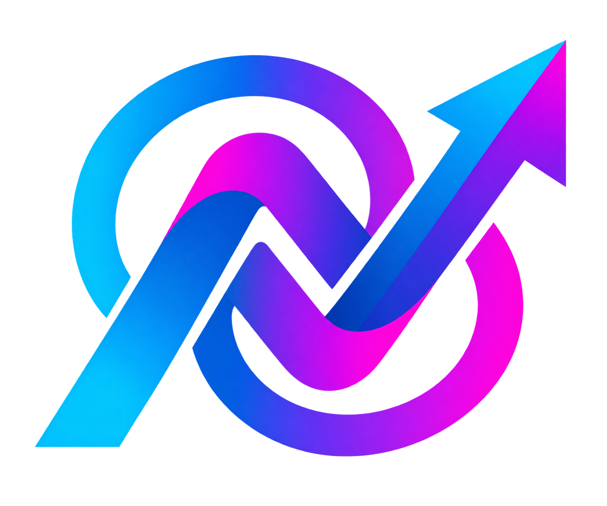

<p align="center">
  
</p>

<h1 align="center">Nexa Agency</h1>

<p align="center">
  <b>Your brand deserves better than "basic".</b><br>
  Digital agency yang berfokus pada pengembangan website &amp; identitas digital custom untuk UMKM, bisnis, organisasi, maupun personal branding.
</p>

<p align="center">
  
  
</p>

---

## 📖 Tentang Nexa Agency

**Nexa Agency** adalah digital agency yang berfokus pada pengembangan website dan identitas digital untuk UMKM, bisnis, organisasi, maupun personal branding. Kami membantu mengubah ide dan kebutuhan klien menjadi solusi digital yang relevan, fungsional, dan memiliki karakter yang kuat.

Layanan Nexa mencakup:
- 🌐 **Website & Company Profile** — website resmi, company profile, dan landing page custom untuk bisnis & UMKM.
- 👤 **Personal Website & Branding** — portofolio digital profesional dan identitas digital yang stand out.
- 🎮 **Gamifikasi & Media Interaktif** — pengalaman digital yang lebih interaktif dan keterlibatan audiens dengan elemen gamifikasi.
- 🤖 **Integrasi AI (Artificial Intelligence)** — pemanfaatan AI ketika dibutuhkan untuk meningkatkan fungsi dan pengalaman pengguna secara optimal.

Kami percaya bahwa setiap brand memiliki cerita dan karakter yang berbeda. Karena itu, setiap solusi yang kami kembangkan dirancang secara **custom**, bukan sekadar menggunakan template yang sama untuk semua kebutuhan.

> **"Your brand deserves better than \"basic\"."**

---

## ✨ Fitur Website

- [x] **Hero Section**: 3-line headline dengan SVG diagonal path drawing animation menggunakan [Anime.js](https://animejs.com/).
- [x] **Tiga Blok Layanan Spesialis**:
  - Web Development (browser preview miring 4° + reactive state)
  - Data Analysis (SVG line chart & pipeline metrics)
  - Game Development (interactive mini-canvas game controls)
- [x] **Portofolio Asimetris**: 1 studi kasus besar + 2 studi kasus pendukung dengan metrik hasil terukur.
- [x] **Metrik Kinerja & Akuntabilitas**: Angka performa teknis dalam `IBM Plex Mono`.
- [x] **Form Konsultasi Terintegrasi**: Direct WhatsApp generator & Email inquiries.
- [x] **Desain Bebas Ciri Khas Template AI**: Berdasarkan panduan [design.md](design.md) (warna gradien logo, font Cabinet Grotesk & Satoshi, no generic shadows).
- [x] **Responsive Mobile-First & Aksesibilitas WCAG** (`outline 2px #3A4CE0`).

---

## 🛠️ Tech Stack

| Layer | Teknologi |
| --- | --- |
| **Framework & Bundler** | [Vue 3](https://vuejs.org/) + [Vite](https://vitejs.dev/) |
| **Styling** | [TailwindCSS](https://tailwindcss.com/) (Custom Nexa Tokens) |
| **Animation Engine** | [Anime.js](https://animejs.com/) |
| **Typography** | Cabinet Grotesk, Satoshi, IBM Plex Mono |
| **Icons & Media** | Lucide Icons, Clean SVG Components |

---

## 📁 Struktur Folder

```text
nexa-company/
├── assets/                  # Logo dan visual assets
├── src/
│   ├── components/
│   │   ├── Navbar.vue       # Header & navigasi responsif
│   │   ├── HeroSection.vue  # Hero dengan Anime.js SVG path drawing
│   │   ├── ServicesSection.vue # 3 blok layanan dengan visual unik
│   │   ├── PortfolioSection.vue# Asymmetrical portfolio grid
│   │   ├── MetricsSection.vue  # Metrik performa IBM Plex Mono
│   │   ├── ContactSection.vue  # Form konsultasi & WhatsApp direct
│   │   └── Footer.vue       # Minimal 3-service footer
│   ├── App.vue              # Main Vue application
│   ├── main.js              # Vue entrypoint
│   └── style.css            # Design tokens & base styles
├── design.md                # Dokumentasi Design System Nexa
├── index.html
├── package.json
├── tailwind.config.js
├── vite.config.js
└── README.md
```

---

## 🚀 Menjalankan Proyek

```bash
# 1. Clone repository
git clone https://github.com/imanyunar/nexa-company.git
cd nexa-company

# 2. Install dependencies
npm install

# 3. Jalankan development server
npm run dev

# 4. Build untuk produksi
npm run build
```

---

## 🎯 Layanan Kami

### 🌐 Web Development
Pembuatan website profesional, landing page, hingga web app custom sesuai kebutuhan bisnis klien.

### 📊 Data Analysis
Analisis data bisnis, dashboard visualisasi, dan laporan insight untuk mendukung strategi berbasis data.

### 🎮 Game Development
Pengembangan game 2D/3D untuk kebutuhan komersial maupun edukasi menggunakan engine modern.

---

## 💼 Portofolio & Studi Kasus

Berikut beberapa proyek unggulan yang telah live di lingkungan produksi:

1. **[LENTERA — Pemerintah Kabupaten Indramayu](https://lentera.indramayukab.go.id/)**  
   *Platform digital sentral untuk pelayanan publik, data sektoral ekonomi kerakyatan, dan keterbukaan informasi terpadu berbasis Progressive Web App (PWA).*
2. **[Visit Gumiwang](https://visitgumiwang.web.id/)**  
   *Portal web promosi pariwisata, agrikultur, perikanan, dan katalog digital produk UMKM Desa Gumiwang.*
3. **[CatatKas UMKM](https://catatkas-web.vercel.app/)**  
   *Aplikasi web pencatatan dan pembukuan keuangan digital praktis bagi pelaku usaha mikro.*

---

## 👥 Tim

| Nama | Peran |
| --- | --- |
| - | Founder / Full-stack Developer |
| - | - |

---

## 📬 Kontak

- 🌐 **Website:** -
- 📧 **Email:** -
- 💬 **WhatsApp:** -
- 📷 **Instagram:** -

---

## 📄 Lisensi

Proyek ini menggunakan lisensi [MIT](LICENSE) — bebas digunakan dan dimodifikasi dengan tetap mencantumkan atribusi.
